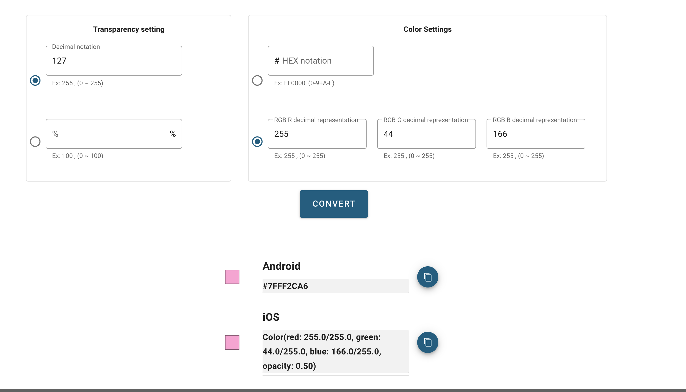

# AppColor
This service converts RGB to color format for iOS and Android.

## Site
[https://appcolor.net/](https://appcolor.net/)

## Use case
- opacity: 127 , RGB 255,44,166 ?
  - iOS(Color(red: 255.0/255.0, green: 44.0/255.0, blue: 166.0/255.0, opacity: 0.50)) 
  - Android(#7FFF2CA6)
- opacity: 40% , HEX #3366AA
  - iOS(Color(red: 51.0/255.0, green: 102.0/255.0, blue: 170.0/255.0, opacity: 0.40)) 
  - Android(#663366AA)

